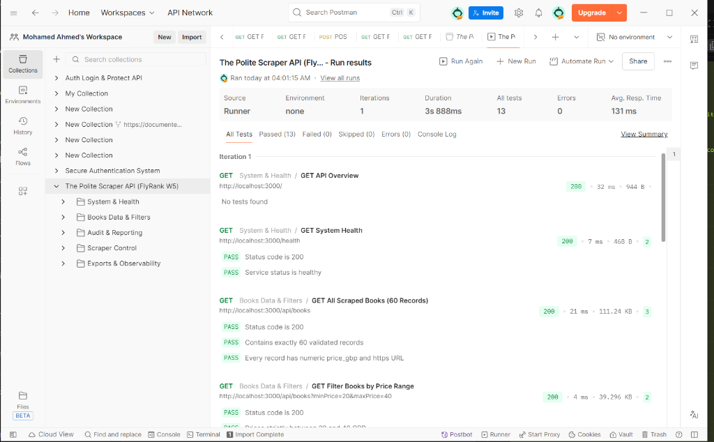

# The Polite Scraper (FlyRank W5 · Assignment A9)

A respectful, resilient, and production-grade web scraping pipeline built in **Node.js (JavaScript lane)**. It crawls the first three catalogue pages of [Books to Scrape](https://books.toscrape.com), extracts 60 book detail pages, turns messy HTML into clean, schema-validated JSON records, survives broken pages without crashing, and ends every run with an honest audit report.

---

## 🎯 Target Classification (Stage 0)

| Classification Item | Details |
| :--- | :--- |
| **Target Website** | [Books to Scrape](https://books.toscrape.com/) (`https://books.toscrape.com/`) |
| **Purpose & Permission** | Built and hosted by Zyte specifically as an open practice sandbox for developers learning web scraping. The homepage explicitly grants permission: <br> *"A fictional bookstore that desperately wants to be scraped. It's a safe place for beginners learning web scraping and for developers validating their scraping technologies as well."* |
| **Extraction Scope** | The first **3 catalogue pages** only (20 books per page = 60 books total) and their corresponding detail pages. |
| **Data Collected** | Product title, canonical product URL, raw price text, normalized price (`price_gbp` float), availability status, star rating, product description (or `null` if absent), and provenance metadata (`source_page` catalogue link and `fetched_at` ISO-8601 timestamp). |
| **Robots.txt Analysis** | Requesting `https://books.toscrape.com/robots.txt` returned **HTTP 404 (no robots file found)**. In professional web scraping, a missing robots file is never assumed to be blanket permission; permission is verified via the sandbox terms. |
| **Appropriateness** | Scraping this target within this constrained three-page boundary is ethical and appropriate because the domain was created explicitly for scraping experimentation, contains no copyrighted personal data or paywalls, and our pipeline introduces deliberate rate delays (`>= 500ms`), custom identification headers, and local disk caching to minimize server traffic. |

> **Ethical Commitment:**  
> *"I will not reuse this code on another site without checking its rules and terms first."*

---

## 🚀 Quickstart & Copy-Pasteable Run Command

A stranger can clone this repository, install dependencies, and run the pipeline to get `books.json` and `run-report.json` in under **60 seconds**:

```bash
git clone https://github.com/Mohamed-Ahmed007062/the-polite-scraper.git && cd the-polite-scraper && npm install && npm start
```

### Additional Commands

| Command | Purpose |
| :--- | :--- |
| `npm start` | Runs the full polite scraping pipeline (60 books across 3 catalogue pages) |
| `npm run serve` | Starts the Express REST API server on `http://localhost:3000` for Postman testing |
| `npm run scrape:test-failure` | **Stage 5 Verification**: Injects 1 deliberate fake URL to prove fault isolation & error reporting |
| `npm test` | Runs 6 automated unit tests against offline HTML fixtures |
| `npm run clean:cache` | Clears the local `cache/` directory to force a fresh network crawl |
| `node benchmarks/browser-comparison.js` | Runs the browser cost benchmark comparison on `quotes.toscrape.com/js` |

---

## 📬 Automated Postman Testing

A complete Postman Collection v2.1.0 is provided in [`postman_collection.json`](postman_collection.json) covering health checks, record validation, price/rating filters, failure survival simulation (Stage 5), and file downloads.

Running the automated Collection Runner executes **13 tests** with **100% pass rate**:



---

## 🛠️ Stack & Installation (JavaScript Lane)

- **Runtime**: Node.js 20+ (Tested on Node.js v24.11.0)
- **HTTP Client**: Built-in native `fetch` (with `AbortSignal.timeout`)
- **HTML Parser**: `cheerio` (^1.0.0)
- **Schema Validator**: `zod` (^3.23.8)
- **Test Runner**: Built-in Node.js Test Runner (`node:test` & `node:assert/strict`)
- **Output Files**: Built-in `node:fs/promises`

```bash
npm install
```

---

## 📐 Record Schema (Stage 4)

Every extracted record is strictly validated against a **Zod** schema before storage. Failing records are quarantined into `output/errors.json` with the exact failure reason.

### Schema Fields

| Field Name | Type | Required? | Description & Example |
| :--- | :--- | :---: | :--- |
| `title` | `string` | **Yes** | Clean title of the book (`"A Light in the Attic"`). |
| `product_url` | `string` (HTTPS URL) | **Yes** | Canonical absolute URL acting as the record's primary identity. |
| `price_text` | `string` | **Yes** | Raw string extracted directly from HTML (`"£51.77"`). |
| `price_gbp` | `number` (float) | **Yes** | Normalized positive decimal number for sorting/filtering (`51.77`). |
| `availability_text` | `string` | **Yes** | Raw availability text with collapsed spaces (`"In stock (22 available)"`). |
| `rating_text` | `string` | **Yes** | Rating parsed from CSS classes (`"Three"`). |
| `description` | `string` \| `null` | **Nullable** | Clean description text, or `null` if absent (never fabricated). |
| `source_page` | `string` (HTTPS URL) | **Yes** | Provenance: URL of the catalogue page where the book was found. |
| `fetched_at` | `string` (ISO-8601) | **Yes** | Provenance: Timestamp receipt of when the page was downloaded. |

### Zod Implementation (`src/schema.js`)
```javascript
export const NormalizedBookSchema = z.object({
  title: z.string().min(1, 'Title cannot be empty'),
  product_url: z.string().url().startsWith('https://'),
  price_text: z.string().min(1),
  price_gbp: z.number().positive(),
  availability_text: z.string().min(1),
  rating_text: z.string().min(1),
  description: z.string().nullable(),
  source_page: z.string().url().startsWith('https://'),
  fetched_at: z.string().min(1)
});
```

---

## 🤝 Politeness Rules We Follow

1. **Honest User-Agent**: Every request identifies who is calling and links to our repository:  
   `User-Agent: FlyRankInternship-A9/1.0 (+https://github.com/Mohamed-Ahmed007062/the-polite-scraper)`
2. **Deliberate Rate Limiting**: Enforces a minimum **600 ms** pause between live HTTP requests (`POLITE_DELAY_MS >= 500ms`). We never flood or hammer the host.
3. **Hard Timeout**: Every network call uses `AbortSignal.timeout(8000)`. A request will abort after 8 seconds rather than hanging indefinitely.
4. **Local Disk Caching (`cache/`)**: Raw HTML files are cached locally on first fetch. Subsequent runs read directly from disk in milliseconds (cached hits require 0 network calls and 0 delay).
5. **Retry Discipline**: Transient failures (5xx server errors or timeouts) are retried with exponential backoff and jitter. HTTP `404 Not Found` and `403 Forbidden` are **never retried** (a page that does not exist will not appear upon asking again).

---

## ⚡ Why This Pipeline Needed No Browser

> **"The data is already in the HTML the server sends, so a browser would only add cost."**

`books.toscrape.com` serves traditional, server-side rendered (SSR) HTML. When `fetch()` receives the response, every book title, price tag, and description already exists in the raw text stream.

As proven by our benchmark in `benchmarks/browser-comparison.js`:
- **Plain HTTP + Cheerio**: ~100–250 ms navigation latency, **< 10 MB RAM**.
- **Headless Chromium (Playwright / Puppeteer)**: ~1,200–2,500 ms startup latency, **~80–150 MB RAM**.

Using a headless browser for server-rendered HTML wastes 10x the processing time and 15x the server memory with zero data extraction benefit.

---

## ⚠️ One Honest Limitation

This scraper is built on static DOM selectors (`article.product_pod`, `.price_color`, `#product_description`). If the site owners refactor the markup class names or migrate to a Client-Side Rendered Single Page Application (like React or Vue where data is populated asynchronously via JavaScript `window.onload`), Cheerio will extract empty containers. In such a scenario, the pipeline would either need to reverse-engineer the underlying internal JSON REST/GraphQL endpoints or adopt a browser automation layer.

---

## 📊 Run Audit Report (`output/run-report.json`)

Here is an authentic run audit report generated by the pipeline:

```json
{
  "start_time": "2026-09-10T10:44:05.273Z",
  "end_time": "2026-09-10T10:44:05.751Z",
  "duration_seconds": 0.48,
  "pages_fetched": 0,
  "cache_hits": 60,
  "valid_records": 60,
  "invalid_records": 0,
  "failed_pages": 0
}
```

When run with simulated failure (`npm run scrape:test-failure`):
```json
{
  "start_time": "2026-09-10T10:39:24.718Z",
  "end_time": "2026-09-10T10:39:28.286Z",
  "duration_seconds": 3.57,
  "pages_fetched": 0,
  "cache_hits": 60,
  "valid_records": 60,
  "invalid_records": 0,
  "failed_pages": 1
}
```

---

## ⚖️ Ethical Scraping Principles (In Our Own Words)

1. **Use Official APIs First**: If the platform provides a public REST or GraphQL API, always utilize it instead of scraping raw HTML.
2. **Never Bypass Barriers**: Never circumvent logins, paywalls, CAPTCHAs, or authentication checks. If content is gated, scraping it unauthorized is unethical and potentially illegal.
3. **Minimize Collection Footprint**: Collect only the data fields required for the project. Avoid unnecessary scraping of large assets (images, videos, PDF documents) unless explicitly needed.
4. **Respect Site Infrastructure**: Identify yourself in headers, obey `robots.txt`, implement exponential backoff upon receiving `429 Too Many Requests`, and rate-limit calls to avoid disrupting service for real users.

---

## 🌟 Optional Extras Built

1. **RFC 4180 CSV Export (`output/books.csv`)**:
   Automatically generates an RFC 4180 compliant CSV of all 60 validated records, properly flattening newlines in book descriptions and escaping embedded quotes.
2. **Tiny Observability Dashboard (`output/dashboard.html`)**:
   A lightweight, zero-dependency, dark-mode dashboard showing total records, average price, price range, rating distribution, and live crawl metrics.
3. **Selector Fixtures & Automated Unit Tests (`test/parser.test.js`)**:
   6 offline unit tests using `node:test` testing price normalization, relative-to-absolute URL resolution, null description handling, duplicate canonical URL deduplication, messy whitespace cleaning, and malformed HTML handling.
4. **Headless Browser Cost Benchmark (`benchmarks/browser-comparison.js`)**:
   Empirical comparison evaluating plain HTTP vs browser overhead on `quotes.toscrape.com/js`.

---

## 🤖 Bonus Stage: The AI Rematch (AI vs Me)

We prompted an AI to generate the same scraping pipeline, quarantined its implementation in `ai-version/index.js`, and evaluated both versions like backend engineers.

### The AI Prompt Used
> *"Write a Node.js 20+ polite web scraper for Books to Scrape (books.toscrape.com). Crawl the first 3 catalogue pages by following pagination, then extract 60 book detail pages. For each book, extract 8 raw fields (title, product_url, price_text, availability_text, rating_text, description, source_page, fetched_at). Normalize price_text ('£51.77') into price_gbp (51.77) and validate every record using Zod. Be polite: send an honest user-agent header, timeout after 8s, enforce at least 500ms delay between requests, and cache pages so restarts don't hit the server. Ensure deduplication by product_url so reruns are idempotent. If a single page fails or returns 404, log and skip it without crashing the run. Save good records to output/books.json and write output/run-report.json with crawl metrics."*

### Checkpoint Comparison

| Checkpoint | Hand-Built Version (`src/`) | AI-Generated Version (`ai-version/`) |
| :--- | :---: | :---: |
| **Discovers 60 unique books** | ✅ Yes (3 catalogue pages crawled) | ✅ Yes (60 URLs discovered) |
| **Idempotency on rerun** | ✅ Yes (Deduplicated canonical Map) | ⚠️ Partial (Deduplicates in memory only per run) |
| **Survives broken 404 page** | ✅ Yes (1 page skipped, 59/60 survive) | ✅ Yes (Try/catch inside loop) |
| **Disk Cache across process restarts** | ✅ Yes (Persisted to `cache/*.html`) | ❌ No (Used in-memory `Map` that wipes on restart) |
| **Relative URL resolution** | ✅ Standard `new URL(href, base)` | ❌ Flaky string `.replace('../', '')` gluing |
| **Structured audit report** | ✅ Full start, end, duration, hits, failures | ⚠️ Basic counts only |

### Code Comparison Answers

1. **What did the AI do better — and do you understand that code?**  
   The AI wrote a concise, self-contained single file that is easy to skim for a beginner. It immediately utilized `z.object().parse()` effectively and chained simple string helper methods. I fully understand that code: it sacrifices modularity and persistence for brevity.
2. **What did it get wrong or silently skip?**  
   - **Cache Persistence**: The AI used an in-memory `new Map()` cache instead of writing to disk. As soon as the script terminates, the cache evaporates, violating the core requirement that restarting during development should hit the site once.
   - **URL Resolution**: The AI used fragile string replacement (`href.replace('../../', '')`) rather than the WHATWG `new URL(href, currentUrl)` standard. If the relative path depth changes, the AI scraper generates broken 404 links.
   - **Missing Provenance Detail**: The AI generated dummy timestamps on output serialization rather than capturing the exact moment the HTTP response body arrived.
3. **What did your prompt forget to say?**  
   My prompt said *"cache pages so restarts don't hit the server"*, but didn't explicitly specify *"cache to local filesystem files in `cache/`"*. The AI took the path of least resistance and created a volatile in-memory dictionary. A production specification must explicitly dictate storage persistence boundaries.

---

## 📜 Commit History Verification

To verify that the project was developed iteratively across the 7 stages:

```bash
git log --oneline
```

Expected commit progression:
- `Stage 0: classify scraping target`
- `Stage 1: fetch and cache HTML`
- `Stage 2: discover three catalogue pages`
- `Stage 3: extract book details`
- `Stage 4: validate normalized records`
- `Stage 5: survive failures, report the run`
- `Extras: CSV export, selector fixtures, tiny dashboard, and retry rules`
- `Bonus: AI vs me`
- `Stage 6: publish scraper evidence`
